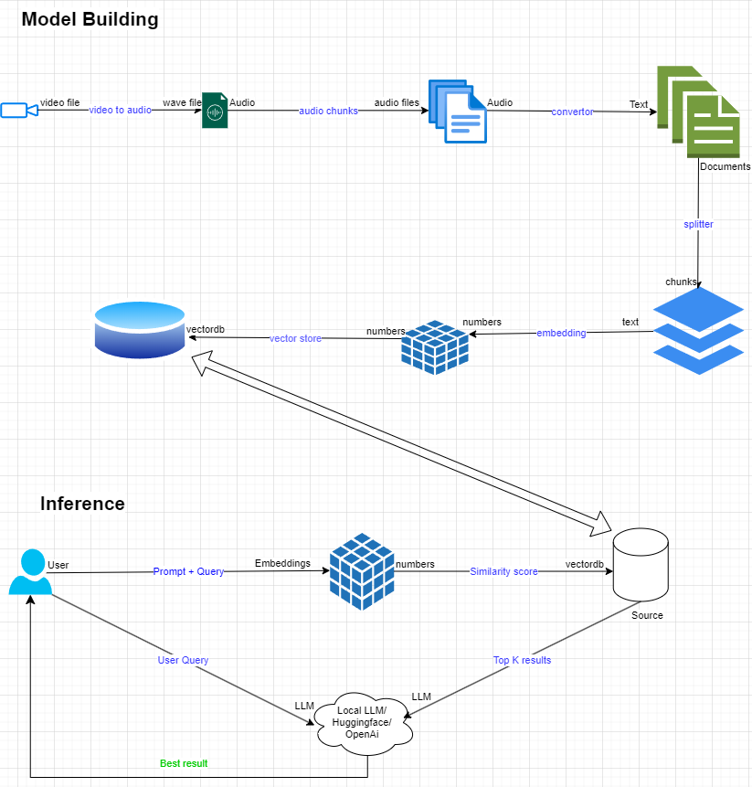

# RAG_video_files
To design a RAG system using a video file using gemini-pro




```
    converted video to audio file format - 
    1. recording the video file and converting to audio wave file
    2. The large audio wave file is converted into small chunks of audio wave files
    3. The below script is executed and the video is played
    4. when the user wants to stop as per keyboard interuption - the file is saved as audio wave file
    5. The audio wave file is converted into many chunks of the same audio wave
    6. The files are saved under the directory - chunked which is input to below code

    script : src/python voice_recorder.py

```